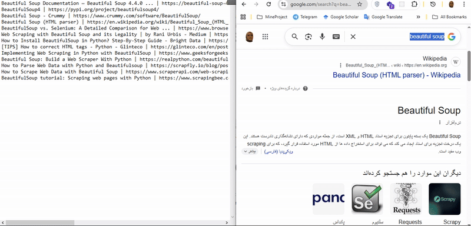

# Google Search Scraper

A simple Python tool to scrape Google search results using Selenium and BeautifulSoup. This project allows you to extract titles and URLs from Google search results and save them to a file.

This GIF demonstrates how the scraper loads Google search results using Selenium and extracts the page titles with BeautifulSoup. All results are automatically saved into a text file.

  

# 🚀 Features

Scrape titles and links from Google search results.

Works with the latest Google HTML structure (handles dynamic content).

Saves results to a text file for easy access.

Fully automated with Selenium WebDriver.

Can be easily adapted for other queries or custom selectors.

# 💻 Installation

 1. Clone the repository:

`git clone https://github.com/yourusername/google-search-scraper.git
cd google-search-scraper`

 2. Install dependencies:

`pip install -r requirements.txt`

requirements.txt should contain:

`selenium
beautifulsoup4`

 3. Download ChromeDriver that matches your Chrome version

# ⚡ Usage

Open scraper.py and set your search term:

`search_term = "beautifulsoup"`

Run the script:

`python scraper.py`

The script will open a browser, go to Google, wait for results, and scrape all titles and links.

Results will be saved in names.txt in the format:

Title 1 | URL 1
Title 2 | URL 2
...

# 🛠 How It Works

 1. Open Google with Selenium.

 2. Load search results dynamically.

 3. Wait until results are fully rendered.

 4. Parse HTML with BeautifulSoup.

 5. Extract titles and links using CSS selectors.

 6. Save to file for further processing.

# ⚠️ Notes

Google may show CAPTCHA if too many requests are made quickly.

If the page structure changes, you may need to update the CSS selectors.

You can run Selenium in headless mode to avoid opening the browser window.

Use responsibly to avoid violating Google's Terms of Service.

# ✨ Contributing

Feel free to submit pull requests or open issues!
Ideas:

Add headless mode.

Add support for multiple pages of results.

Export results to CSV or JSON.

# 📜 License

MIT License © 2025 [reyhaneh ghafouripour]
